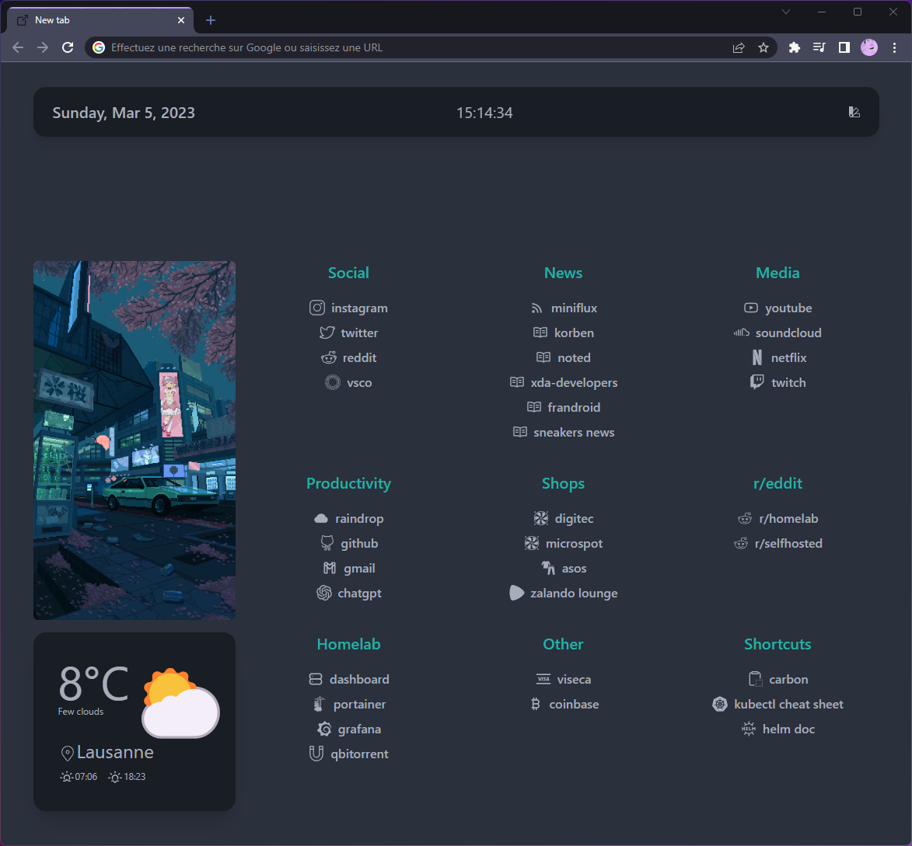

<div align="center">
<h1>Vaporflow Chrome Startpage<br/>≋≋≋（🗻📼🌸🌴⛲️🐬💾 ）≋≋≋</h1>


</div>

---------------------------------------------------------------------------

"Vaporflow is a browser start page where I have gathered the elements that I like the most about the projects found on [r/startpages](https://www.reddit.com/r/startpages/). This Chrome extension (and soon Firefox as well) embeds these features:"

- Based on Tailwind CSS + Daisy UI component
- OpenWeather
- React + Typescript
- Support Manifest V3

---------------------------------------------------------------------------

## Table of Contents

<!-- START doctoc generated TOC please keep comment here to allow auto update -->
<!-- DON'T EDIT THIS SECTION, INSTEAD RE-RUN doctoc TO UPDATE -->
**Table of Contents**

- [Intro](#intro)
- [Usage](#usage)
  - [Prerequisite for OpenWeather](#prerequisite-for-openweather)
  - [Setup](#setup)
  - [Configs](#configs)
  - [Bookmarks](#bookmarks)
- [Tech Docs <a name="tech"></a>](#tech-docs-a-nametecha)
- [Contributing <a name="contributing"></a>](#contributing-a-namecontributinga)

<!-- END doctoc generated TOC please keep comment here to allow auto update -->

## Intro

Welcome to the Vaporflow Chrome Extension README! Vaporflow is a stylish and customizable browser start page that is now available as a Chrome extension. Built on top of Chrome Extension [Boilerplate React Vite](https://github.com/Jonghakseo/chrome-extension-boilerplate-react-vite), Vaporflow is powered by React 18 and TypeScript, and uses Vite as its build tool. The design is based on the popular Tailwind CSS framework, with added components from Daisy UI, to make customization a breeze. It supports the latest Chrome Extension Manifest V3 specification.

As soon as the Boilerplate template supports manifest v3, support will be added in this repo as well.

- Read more about Chrome manifest v2 support [here](https://developer.chrome.com/docs/extensions/mv2/).
- Read more about Firefox Manifest v3 support [here](https://discourse.mozilla.org/t/manifest-v3/94564).

## Usage

### Prerequisite for OpenWeather

Want to keep up-to-date with the latest weather conditions right from your start page? No problem! To add the Weather Widget to your start page, simply create an account on [OpenWeather](https://openweathermap.org/) and generate an API KEY.

### Setup

1. Clone of Fork this repository.
2. Run `yarn` or `npm i` (check your node version >= 16)
3. Run `yarn dev` or `npm run dev`
4. Load Extension on Chrome
   1. Open - Chrome browser
   2. Access - chrome://extensions
   3. Check - Developer mode
   4. Find - Load unpacked extension
   5. Select - `dist` folder in this project (after dev or build)
5. If you want to build in production, Just run `yarn build` or `npm run build`.

### Configs

With the [`src/pages/newtab/config.json`](./src/pages/newtab/config.json) file, you can easily set your OpenWeather `API key`, `language`, `units`, `location`, and the page themes to suit your preferences. All theme reference are available in [`tailwind.config.cjs`](tailwind.config.cjs).

```json
// src/pages/newtab/config.json
{
  "username": "Gaël",
  "openweather":{
    "apikey": "YOUR_API_KEY", // 👈 Add your OpenWeather key here
    "language": "en",
    "units": "metric",
    "location": "Lausanne"
  },
  "theme": [ // 👈 See tailwind.config.cjs for more themes
    {
      "name": "Light",
      "emoji": "🖨️",
      "theme": "light"
    },
    {
      "name": "Dark",
      "emoji": "🌑",
      "theme": "dark"
    },
  ]
}
```

Sample theme:


### Bookmarks

The configuration of bookmarks is done in [`src/pages/newtab/Bookmarks.tsx`](./src/pages/newtab/Bookmarks.tsx):

1. Update `const YourLinks = ...` link list

```typescript
/// src/pages/newtab/Bookmarks.tsx
  const socialLinks = [
    {
      href: "https://www.instagram.com/", // 👈 url link
      icon: <SlSocialInstagram className="hidden md:block" size={20} />, // 👈 react-icons
      text: "instagram", // 👈 displayed text
    },
    {
      href: "https://www.twitter.com/",
      icon: <SlSocialTwitter className="hidden md:block" size={20} />,
      text: "twitter",
    },
    ...
  ];
```

2. Update category title

```typescript
/// src/pages/newtab/Bookmarks.tsx
      <div className="col-start-2 text-center">
        <h3 className="text-accent text-xl font-semibold">Social</h3> // 👈 Category title
        {renderLinks(socialLinks)} // 👈 Link list constant
      </div>
```

# Tech Docs <a name="tech"></a>

- [Boilerplate React Vite](https://github.com/Jonghakseo/chrome-extension-boilerplate-react-vite)
- [Vite Plugin](https://vitejs.dev/guide/api-plugin.html)
- [Chrome Extension with manifest 3](https://developer.chrome.com/docs/extensions/mv3/)
- [Rollup](https://rollupjs.org/guide/en/)
- [Rollup-plugin-chrome-extension](https://www.extend-chrome.dev/rollup-plugin)
- [Tailwind CSS](https://tailwindcss.com/docs/configuration)

# Contributing <a name="contributing"></a>

Feel free to open PRs or raise issues!
